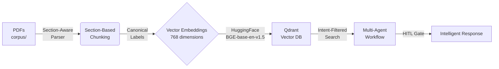

# 🔬 Research Paper Intelligence System

A production-ready **RAG (Retrieval-Augmented Generation)** system for intelligent research paper analysis using **LlamaIndex**, **Qdrant**, and **Multi-Agent Workflows**.

## 🎯 Project Overview

This system ingests PDF research papers, chunks them with section awareness, generates embeddings, and enables intelligent Q&A with proper citations. It features a **3-agent workflow** with intent classification, section-filtered retrieval, and human-in-the-loop controls.



## ✅ Current Progress

### Week 1: Core Infrastructure ✅
| Component | Technology | Status |
|-----------|------------|--------|
| **PDF Parsing** | LlamaIndex `SimpleDirectoryReader` | ✅ Done |
| **Chunking** | LlamaIndex `SentenceSplitter` | ✅ Done |
| **Embeddings** | `BAAI/bge-base-en-v1.5` (768 dim) | ✅ Done |
| **Vector DB** | Qdrant | ✅ Done |
| **API Framework** | FastAPI | ✅ Done |

### Week 2: Intelligent Query Engine ✅
| Component | Technology | Status |
|-----------|------------|--------|
| **LLM Integration** | Groq (`openai/gpt-oss-120b`) | ✅ Done |
| **Query Engine** | LlamaIndex `VectorStoreIndex` | ✅ Done |
| **RAG Pipeline** | Retrieval + Generation | ✅ Done |
| **Query API** | `/api/query` endpoint | ✅ Done |

### Week 3: Multi-Agent Workflow ✅
| Component | Technology | Status |
|-----------|------------|--------|
| **Section-Aware Parser** | `SectionAwarePDFParser` | ✅ Done |
| **Canonical Section Taxonomy** | 13 normalized section types | ✅ Done |
| **Intent Classifier** | Rule-based, priority-ordered | ✅ Done |
| **Section-Filtered Retrieval** | Qdrant metadata filters | ✅ Done |
| **HITL Gate** | Human-in-the-loop controls | ✅ Done |
| **Verbosity Control** | Brief/concise summary mode | ✅ Done |
| **Streamlit Frontend** | Temporary demo UI | ✅ Done |
| **3-Agent Workflow** | Query → Retrieval → Analysis | ✅ Done |

### Week 4: Guardrails AI ✅
| Component | Technology | Status |
|-----------|------------|--------|
| **RAIL Schema** | Guardrails AI RAIL format | ✅ Done |
| **Pydantic Validation** | `ValidatedAnswer` model | ✅ Done |
| **Citation Grounding** | Rule-based verification | ✅ Done |
| **Hallucination Detection** | Heuristic-based checks | ✅ Done |
| **Auto-Retry** | Schema validation retry (max 1) | ✅ Done |
| **HITL Escalation** | Guardrails → HITL pipeline | ✅ Done |

### Week 5: Current State ✅
**Fully Operational Production-Grade RAG System**
- � All core features implemented
- 🛡️ Guardrails AI validation active
- 📊 Multi-agent workflow operational
- 🔍 Section-aware retrieval working
- 💬 Streamlit demo UI available

## �🏗️ Architecture

### Multi-Agent Workflow with Guardrails
```
User Question
    ↓
┌────────────────────────┐
│  Query Orchestrator    │  → Intent Classification
│  Agent                 │  → Section Targeting
└────────────────────────┘
    ↓
┌────────────────────────┐
│  Evidence Retrieval    │  → Metadata-Filtered Search
│  Agent                 │  → Qdrant Vector Query
└────────────────────────┘
    ↓
┌────────────────────────┐
│  HITL Gate             │  → Confidence Check
│  (Deterministic)       │  → Low Evidence → BLOCK
└────────────────────────┘
    ↓
┌────────────────────────┐
│  Analysis & Synthesis  │  → LLM Reasoning
│  Agent                 │  → Cited Answer
└────────────────────────┘
    ↓
┌────────────────────────┐
│  Guardrails AI         │  → Schema Validation
│  Validation Layer      │  → Citation Grounding
│                        │  → Hallucination Detection
└────────────────────────┘
    ↓
• If Valid → Stop Event (Answer)
• If Invalid → HITL Event (Review Required)
```

### Intent Classification System
| Intent | Allowed Sections | Priority |
|--------|------------------|----------|
| `citation` | References | 100 |
| `limitations` | Discussion, Limitations | 90 |
| `future_work` | Future Work | 85 |
| `research_gaps` | Discussion, Limitations, Future Work | 80 |
| `methodology` | Methods | 70 |
| `experiments` | Experiments, Results | 60 |
| `results` | Results | 50 |
| `comparison` | Results, Experiments | 40 |
| `summary` | Abstract, Introduction | 20 |
| `general` | Abstract, Introduction, Methods, Results | 10 |

### Canonical Section Taxonomy
Only these 13 section labels are stored in the vector database:
```
Abstract, Introduction, Related Work, Methods, Experiments,
Results, Discussion, Limitations, Future Work, Conclusion,
References, Appendix, Unknown
```

### HITL Gate Trigger Conditions
Human review is required if ANY of:
- `retrieved_chunks_count < 2`
- `intent_confidence < 0.6`
- `top_similarity_score < 0.5`

## 🛠️ Tech Stack

| Layer | Technology | Purpose |
|-------|------------|---------|
| **Framework** | LlamaIndex | RAG orchestration |
| **LLM** | Groq (openai/gpt-oss-120b) | Response generation |
| **Embeddings** | BAAI/bge-base-en-v1.5 | Text → 768-dim vectors |
| **Vector DB** | Qdrant | Similarity search with filters |
| **PDF Reader** | LlamaIndex + PyMuPDF | Document ingestion |
| **API** | FastAPI | REST endpoints |
| **Frontend** | Streamlit (temporary) | Demo UI |
| **Workflow** | LlamaIndex Workflow | Event-driven agents |

## 📁 Project Structure

```
research-paper-intelligence-system/
├── corpus/                         # Put your PDFs here
│   ├── paper1.pdf
│   └── paper2.pdf
├── backend/
│   └── app/
│       ├── api/routes/
│       │   ├── search.py           # Vector search endpoints
│       │   ├── query.py            # Intelligent query endpoints
│       │   └── workflow_query.py   # Workflow-based query
│       ├── agents/
│       │   ├── query_orchestrator.py   # Agent 1: Intent & routing
│       │   ├── evidence_retrieval.py   # Agent 2: Section-filtered search
│       │   └── analysis_synthesis.py   # Agent 3: LLM reasoning
│       ├── db/
│       │   └── qdrant_client.py    # Qdrant with metadata filters
│       ├── models/
│       │   ├── paper.py            # Paper data models
│       │   ├── chunk.py            # Chunk data models
│       │   ├── query.py            # Query request/response
│       │   └── events.py           # Workflow events
│       ├── services/
│       │   ├── pdf_parser.py       # SectionAwarePDFParser
│       │   ├── chunking.py         # Section-aware chunking
│       │   ├── embeddings.py       # HuggingFace embeddings
│       │   ├── llm_service.py      # Groq LLM integration
│       │   ├── intent_classifier.py # Rule-based intent detection
│       │   ├── hitl_gate.py        # Human-in-the-loop controls
│       │   └── query_engine.py     # Intelligent Query Engine
│       ├── workflows/
│       │   └── research_workflow.py # LlamaIndex Workflow
│       ├── config.py               # Settings & configuration
│       └── main.py                 # FastAPI app
├── frontend/
│   └── app.py                      # Streamlit UI (temporary)
├── build_corpus.py                 # Main ingestion script
├── interactive_query.py            # CLI Q&A interface
├── docker-compose.yml              # Qdrant container
├── requirements.txt                # Python dependencies
├── .env                            # Environment variables
└── README.md
```

## 🚀 Quick Start

### 1. Prerequisites
- Python 3.10+
- Docker (for Qdrant)
- Groq API key (free at https://console.groq.com)

### 2. Setup

```bash
# Clone and navigate
cd research-paper-intelligence-system

# Create virtual environment
python -m venv venv_clean
.\venv_clean\Scripts\activate  # Windows
# source venv_clean/bin/activate  # Linux/Mac

# Install dependencies
pip install -r requirements.txt
```

### 3. Environment Variables

Create `.env` file:
```env
GROQ_API_KEY=your_groq_api_key_here
```

### 4. Start Qdrant

```bash
docker-compose up -d
```

### 5. Add PDFs & Build Corpus

```bash
# Place PDFs in corpus/ folder
# Then build the vector database
python build_corpus.py
```

### 6. Run the System

**Option A: Interactive CLI**
```bash
python interactive_query.py
```

**Option B: FastAPI + Streamlit**
```bash
# Terminal 1: Start backend
cd backend
uvicorn app.main:app --reload

# Terminal 2: Start frontend
streamlit run frontend/app.py
```

Visit:
- API Docs: http://localhost:8000/docs
- Streamlit UI: http://localhost:8501

## 💡 Example Queries

| Query | Intent | Sections Searched |
|-------|--------|-------------------|
| "What is LoRA?" | `summary` | Abstract, Introduction |
| "How does QLoRA work?" | `methodology` | Methods |
| "What are the limitations?" | `limitations` | Discussion, Limitations |
| "Compare LoRA and full fine-tuning" | `comparison` | Results, Experiments |
| "Give a brief summary" | `summary` (brief mode) | Abstract, Introduction |

## ⚙️ Configuration

Edit `backend/app/config.py`:

```python
# Embedding Model
embedding_model: str = "BAAI/bge-base-en-v1.5"
embedding_dim: int = 768

# Chunking
chunk_size: int = 1000
chunk_overlap: int = 200

# Qdrant
qdrant_host: str = "localhost"
qdrant_port: int = 6333
qdrant_collection_name: str = "research_papers"

# LLM
llm_model: str = "openai/gpt-oss-120b"
```

## 🔬 Key Features

### Section-Aware Chunking
- Detects real section headers (Abstract, Methods, Results, etc.)
- Normalizes to 13 canonical section names
- Rejects noise (tables, figures, OCR artifacts)

### Intent-Based Retrieval
- Rule-based intent classifier (no ML/LLM)
- Priority-ordered conflict resolution
- Metadata-filtered vector search

### Human-in-the-Loop Controls
- Blocks low-confidence answers
- Returns structured review requests
- Deterministic trigger conditions

### Verbosity Control
- Detects "brief/short/small" hints
- Produces concise bullet-point answers
- No LLM reasoning for verbosity

### Guardrails AI Validation
- **Pydantic Schema Enforcement**: Strict JSON output with `ValidatedAnswer` model
- **Citation Grounding**: Verifies all citations exist in retrieved chunks
- **Hallucination Detection**: Heuristic-based pattern matching
- **Auto-Retry**: Automatically re-asks LLM once if validation fails
- **HITL Escalation**: Triggers human review when quality is insufficient

## 🗺️ Roadmap

- [x] **Week 1**: PDF → Chunks → Embeddings → Qdrant
- [x] **Week 2**: RAG Query Engine with LlamaIndex + Groq LLM
- [x] **Week 3**: Multi-Agent Workflow + HITL + Section Filtering
- [x] **Week 4**: Guardrails AI + Schema Validation
- [x] **Week 5**: Production-Grade RAG System (Current)
- [ ] **Week 6**: Cloud Deployment + Monitoring

## 📝 License

MIT License

---

Built with ❤️ using LlamaIndex, Qdrant, Groq, and Streamlit
