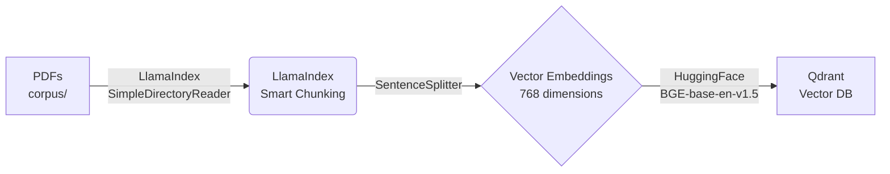

# 🔬 Research Paper Intelligence System

A production-ready RAG (Retrieval-Augmented Generation) pipeline for processing and searching research papers using **LlamaIndex**, **HuggingFace embeddings**, and **Qdrant** vector database.

## 🎯 Project Overview

This system ingests PDF research papers, chunks them intelligently, generates embeddings, and stores them in a vector database for semantic search.



## ✅ Current Progress

### Week 1: Core Infrastructure (Completed)

| Component | Technology | Status |
|-----------|------------|--------|
| **PDF Parsing** | LlamaIndex `SimpleDirectoryReader` | ✅ Done |
| **Chunking** | LlamaIndex `SentenceSplitter` | ✅ Done |
| **Embeddings** | `BAAI/bge-base-en-v1.5` (768 dim) | ✅ Done |
| **Vector DB** | Qdrant | ✅ Done |
| **API Framework** | FastAPI | ✅ Done |

### Features Implemented

- 📄 **PDF Processing**: Automatic text extraction using LlamaIndex
- ✂️ **Smart Chunking**: Sentence-aware splitting with configurable overlap
- 🧠 **Free Embeddings**: Local HuggingFace model (no API costs!)
- 🗄️ **Vector Storage**: Qdrant for fast similarity search
- 🔍 **Search API**: FastAPI endpoints for querying

## 🛠️ Tech Stack

| Layer | Technology | Purpose |
|-------|------------|---------|
| **Framework** | LlamaIndex | RAG orchestration |
| **Embeddings** | BAAI/bge-base-en-v1.5 | Text → 768-dim vectors |
| **Vector DB** | Qdrant | Similarity search |
| **PDF Reader** | LlamaIndex + PyMuPDF | Document ingestion |
| **API** | FastAPI | REST endpoints |
| **Chunking** | SentenceSplitter | Semantic text splitting |

## 📁 Project Structure

```
research-paper-intelligence-system/
├── corpus/                     # Put your PDFs here
│   ├── paper1.pdf
│   └── paper2.pdf
├── backend/
│   └── app/
│       ├── api/               # FastAPI routes
│       │   └── routes/
│       │       └── search.py
│       ├── db/
│       │   └── qdrant_client.py   # Qdrant integration
│       ├── models/
│       │   ├── paper.py          # Paper data models
│       │   └── chunk.py          # Chunk data models
│       ├── services/
│       │   ├── pdf_parser.py     # LlamaIndex PDF parsing
│       │   ├── chunking.py       # LlamaIndex SentenceSplitter
│       │   └── embeddings.py     # HuggingFace embeddings
│       ├── config.py             # Settings & configuration
│       └── main.py               # FastAPI app
├── build_corpus.py            # Main ingestion script
├── docker-compose.yml         # Qdrant container
├── requirements.txt           # Python dependencies
└── README.md
```

## 🚀 Quick Start

### 1. Prerequisites

- Python 3.10+
- Docker (for Qdrant)

### 2. Setup

```bash
# Clone and navigate
cd research-paper-intelligence-system

# Create virtual environment
python -m venv venv
venv\Scripts\activate  # Windows
# source venv/bin/activate  # Linux/Mac

# Install dependencies
pip install -r requirements.txt
```

### 3. Start Qdrant

```bash
docker-compose up -d
```

### 4. Add PDFs

Place your research papers in the `corpus/` directory:
```
corpus/
├── paper1.pdf
└── paper2.pdf
```

### 5. Build Corpus

```bash
python build_corpus.py
```

This will:
1. Parse all PDFs using LlamaIndex
2. Chunk text with SentenceSplitter
3. Generate embeddings with BAAI/bge-base-en-v1.5
4. Store in Qdrant vector database

### 6. Start API

```bash
cd backend
uvicorn app.main:app --reload
```

Visit: http://localhost:8000/docs

## ⚙️ Configuration

Edit `backend/app/config.py`:

```python
# Embedding Model
embedding_model: str = "BAAI/bge-base-en-v1.5"
embedding_dim: int = 768

# Chunking
chunk_size: int = 1000      # Max tokens per chunk
chunk_overlap: int = 200    # Overlap between chunks

# Qdrant
qdrant_host: str = "localhost"
qdrant_port: int = 6333
qdrant_collection_name: str = "research_papers"
```

## 🔬 LlamaIndex Components Used

| Component | Import | Purpose |
|-----------|--------|---------|
| `SimpleDirectoryReader` | `llama_index.core` | Load PDFs |
| `SentenceSplitter` | `llama_index.core.node_parser` | Smart chunking |
| `HuggingFaceEmbedding` | `llama_index.embeddings.huggingface` | Generate embeddings |
| `Document` | `llama_index.core.schema` | Document representation |

## 📊 Embedding Model

Using **BAAI/bge-base-en-v1.5**:

- **Dimensions**: 768
- **Type**: Dense embeddings
- **Language**: English
- **Quality**: State-of-the-art on MTEB benchmark
- **Cost**: FREE (runs locally)

## 🗺️ Roadmap

- [x] Week 1: PDF → Chunks → Embeddings → Qdrant
- [ ] Week 2: RAG Query Engine with LlamaIndex
- [ ] Week 3: LLM Integration (Response Generation)
- [ ] Week 4: Production Deployment

## 📝 License

MIT License

---

Built with ❤️ using LlamaIndex, HuggingFace, and Qdrant
