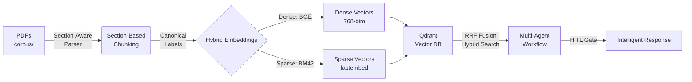

# 🔬 Research Paper Intelligence System

A production-ready **RAG (Retrieval-Augmented Generation)** system for intelligent research paper analysis using **LlamaIndex**, **Qdrant**, and **Multi-Agent Workflows**.

## 🎯 Project Overview

This system ingests PDF research papers, chunks them with section awareness, generates embeddings, and enables intelligent Q&A with proper citations. It features a **3-agent workflow** with intent classification, section-filtered retrieval, and human-in-the-loop controls.



## ✅ Current Progress

### Week 1: Core Infrastructure ✅
| Component | Technology | Status |
|-----------|------------|--------|
| **PDF Parsing** | LlamaIndex `SimpleDirectoryReader` | ✅ Done |
| **Chunking** | LlamaIndex `SentenceSplitter` | ✅ Done |
| **Embeddings** | `BAAI/bge-base-en-v1.5` (768 dim) | ✅ Done |
| **Vector DB** | Qdrant | ✅ Done |
| **API Framework** | FastAPI | ✅ Done |

### Week 2: Intelligent Query Engine ✅
| Component | Technology | Status |
|-----------|------------|--------|
| **LLM Integration** | Groq (`openai/gpt-oss-120b`) | ✅ Done |
| **Query Engine** | LlamaIndex `VectorStoreIndex` | ✅ Done |
| **RAG Pipeline** | Retrieval + Generation | ✅ Done |
| **Query API** | `/api/query` endpoint | ✅ Done |

### Week 3: Multi-Agent Workflow ✅
| Component | Technology | Status |
|-----------|------------|--------|
| **Section-Aware Parser** | `SectionAwarePDFParser` | ✅ Done |
| **Canonical Section Taxonomy** | 13 normalized section types | ✅ Done |
| **Intent Classifier** | Rule-based, priority-ordered | ✅ Done |
| **Section-Filtered Retrieval** | Qdrant metadata filters | ✅ Done |
| **HITL Gate** | Human-in-the-loop controls | ✅ Done |
| **Verbosity Control** | Brief/concise summary mode | ✅ Done |
| **Streamlit Frontend** | Temporary demo UI | ✅ Done |
| **3-Agent Workflow** | Query → Retrieval → Analysis | ✅ Done |

### Week 4: Guardrails AI ✅
| Component | Technology | Status |
|-----------|------------|--------|
| **RAIL Schema** | Guardrails AI RAIL format | ✅ Done |
| **Pydantic Validation** | `ValidatedAnswer` model | ✅ Done |
| **Citation Grounding** | Rule-based verification | ✅ Done |
| **Hallucination Detection** | Heuristic-based checks | ✅ Done |
| **Auto-Retry** | Schema validation retry (max 1) | ✅ Done |
| **HITL Escalation** | Guardrails → HITL pipeline | ✅ Done |

### Week 5: BM42 Hybrid Search ✅
| Component | Technology | Status |
|-----------|------------|--------|
| **Sparse Embeddings** | BM42 via `fastembed` | ✅ Done |
| **Hybrid Collection** | Qdrant dense + sparse | ✅ Done |
| **RRF Fusion** | Reciprocal Rank Fusion (k=60) | ✅ Done |
| **Weight Config** | Dense: 0.5, Sparse: 0.5 | ✅ Done |

### Week 6: Current State ✅
**Fully Operational Production-Grade Hybrid RAG System**
- ✅ All core features implemented
- 🔀 **BM42 Hybrid Search active** (dense + sparse)
- 🛡️ Guardrails AI validation active
- 📊 Multi-agent workflow operational
- 🔍 Section-aware retrieval working
- 💬 Streamlit demo UI available

## �🏗️ Architecture

### Multi-Agent Workflow with Guardrails
```
User Question
    ↓
┌────────────────────────┐
│  Query Orchestrator    │  → Intent Classification
│  Agent                 │  → Section Targeting
└────────────────────────┘
    ↓
┌────────────────────────┐
│  Evidence Retrieval    │  → Metadata-Filtered Search
│  Agent                 │  → Qdrant Vector Query
└────────────────────────┘
    ↓
┌────────────────────────┐
│  HITL Gate             │  → Confidence Check
│  (Deterministic)       │  → Low Evidence → BLOCK
└────────────────────────┘
    ↓
┌────────────────────────┐
│  Analysis & Synthesis  │  → LLM Reasoning
│  Agent                 │  → Cited Answer
└────────────────────────┘
    ↓
┌────────────────────────┐
│  Guardrails AI         │  → Schema Validation
│  Validation Layer      │  → Citation Grounding
│                        │  → Hallucination Detection
└────────────────────────┘
    ↓
• If Valid → Stop Event (Answer)
• If Invalid → HITL Event (Review Required)
```

### Intent Classification System
| Intent | Allowed Sections | Priority |
|--------|------------------|----------|
| `citation` | References | 100 |
| `limitations` | Discussion, Limitations | 90 |
| `future_work` | Future Work | 85 |
| `research_gaps` | Discussion, Limitations, Future Work | 80 |
| `methodology` | Methods | 70 |
| `experiments` | Experiments, Results | 60 |
| `results` | Results | 50 |
| `comparison` | Results, Experiments | 40 |
| `summary` | Abstract, Introduction | 20 |
| `general` | Abstract, Introduction, Methods, Results | 10 |

### Canonical Section Taxonomy
Only these 13 section labels are stored in the vector database:
```
Abstract, Introduction, Related Work, Methods, Experiments,
Results, Discussion, Limitations, Future Work, Conclusion,
References, Appendix, Unknown
```

### HITL Gate Trigger Conditions
Human review is required if ANY of:
- `retrieved_chunks_count < 2`
- `intent_confidence < 0.6`
- `paper_coverage == 0`

> **Note:** Hybrid retrieval scores are rank-based (RRF) rather than absolute similarity values; confidence is computed using evidence coverage and intent reliability instead of raw similarity thresholds.

## 🛠️ Tech Stack

| Layer | Technology | Purpose |
|-------|------------|---------|
| **Framework** | LlamaIndex | RAG orchestration |
| **LLM** | Groq (openai/gpt-oss-120b) | Response generation |
| **Dense Embeddings** | BAAI/bge-base-en-v1.5 | Semantic understanding (768-dim) |
| **Sparse Embeddings** | BM42 via `fastembed` | Keyword matching |
| **Hybrid Search** | RRF Fusion | Dense + Sparse combination |
| **Vector DB** | Qdrant | Hybrid vectors with filters |
| **PDF Reader** | LlamaIndex + PyMuPDF | Document ingestion |
| **API** | FastAPI | REST endpoints |
| **Frontend** | Streamlit (temporary) | Demo UI |
| **Workflow** | LlamaIndex Workflow | Event-driven agents |

## 📁 Project Structure

```
research-paper-intelligence-system/
├── corpus/                             # Research papers (PDFs)
│   ├── paper1.pdf
│   └── paper2.pdf
│
├── backend/                            # FastAPI backend
│   └── app/
│       ├── api/
│       │   └── routes/
│       │       ├── search.py           # Vector search endpoints
│       │       ├── query.py            # Query endpoints
│       │       └── workflow_query.py   # Workflow-based query
│       │
│       ├── agents/                     # Multi-agent system
│       │   ├── query_orchestrator.py   # Agent 1: Intent classification
│       │   ├── evidence_retrieval.py   # Agent 2: Vector retrieval
│       │   └── analysis_synthesis.py   # Agent 3: LLM synthesis
│       │
│       ├── db/
│       │   └── qdrant_client.py        # Qdrant with metadata filters
│       │
│       ├── guardrails/                 # Guardrails AI schemas
│       │   └── answer_schema.rail      # RAIL validation schema
│       │
│       ├── models/                     # Data models
│       │   ├── paper.py                # Paper metadata
│       │   ├── chunk.py                # Chunk + SearchResult
│       │   ├── query.py                # Query request/response
│       │   └── events.py               # Workflow events (5 events)
│       │
│       ├── services/                   # Core services
│       │   ├── pdf_parser.py           # Section-aware PDF parser
│       │   ├── chunking.py             # Canonical section chunking
│       │   ├── embeddings.py           # HuggingFace embeddings
│       │   ├── llm_service.py          # Groq LLM integration
│       │   ├── intent_classifier.py    # Rule-based intent detection
│       │   ├── hitl_gate.py            # Human-in-the-loop controls
│       │   ├── guardrails_service.py   # Guardrails AI validation
│       │   ├── memory.py               # Memory service
│       │   └── query_engine.py         # Query engine
│       │
│       ├── workflows/
│       │   └── research_workflow.py    # LlamaIndex Workflow
│       │
│       ├── config.py                   # Settings & env vars
│       └── main.py                     # FastAPI app
│
├── frontend/                           # Streamlit UI (temporary)
│   └── app.py                          # Demo UI
│
├── build_corpus.py                     # Ingestion pipeline
├── interactive_query.py                # CLI Q&A interface
├── docker-compose.yml                  # Qdrant container
├── requirements.txt                    # Python dependencies
├── .env                                # Environment variables
└── README.md
```

## 🚀 Quick Start

### 1. Prerequisites
- Python 3.10+
- Docker (for Qdrant)
- Groq API key (free at https://console.groq.com)

### 2. Setup

```bash
# Clone and navigate
cd research-paper-intelligence-system

# Create virtual environment
python -m venv venv_clean
.\venv_clean\Scripts\activate  # Windows
# source venv_clean/bin/activate  # Linux/Mac

# Install dependencies
pip install -r requirements.txt
```

### 3. Environment Variables

Create `.env` file:
```env
GROQ_API_KEY=your_groq_api_key_here
```

### 4. Start Qdrant

```bash
docker-compose up -d
```

### 5. Add PDFs & Build Corpus

```bash
# Place PDFs in corpus/ folder
# Then build the vector database
python build_corpus.py
```

### 6. Run the System

**Option A: Interactive CLI**
```bash
python interactive_query.py
```

**Option B: FastAPI + Streamlit**
```bash
# Terminal 1: Start backend
cd backend
uvicorn app.main:app --reload

# Terminal 2: Start frontend
streamlit run frontend/app.py
```

Visit:
- API Docs: http://localhost:8000/docs
- Streamlit UI: http://localhost:8501

## 💡 Example Queries

| Query | Intent | Sections Searched |
|-------|--------|-------------------|
| "What is LoRA?" | `summary` | Abstract, Introduction |
| "How does QLoRA work?" | `methodology` | Methods |
| "What are the limitations?" | `limitations` | Discussion, Limitations |
| "Compare LoRA and full fine-tuning" | `comparison` | Results, Experiments |
| "Give a brief summary" | `summary` (brief mode) | Abstract, Introduction |

## ⚙️ Configuration

Edit `backend/app/config.py`:

```python
# Dense Embedding Model
embedding_model: str = "BAAI/bge-base-en-v1.5"
embedding_dim: int = 768

# BM42 Sparse Embeddings (Hybrid Search)
sparse_embedding_model: str = "Qdrant/bm42-all-minilm-l6-v2-attentions"
enable_hybrid_search: bool = True

# RRF Fusion Parameters
rrf_k: int = 60  # Reciprocal Rank Fusion constant
dense_weight: float = 0.5
sparse_weight: float = 0.5

# Chunking
chunk_size: int = 1000
chunk_overlap: int = 200

# Qdrant
qdrant_host: str = "localhost"
qdrant_port: int = 6333
qdrant_collection_name: str = "research_papers_hybrid"

# LLM
llm_model: str = "openai/gpt-oss-120b"
```

## 🔬 Key Features

### Section-Aware Chunking
- Detects real section headers (Abstract, Methods, Results, etc.)
- Normalizes to 13 canonical section names
- Rejects noise (tables, figures, OCR artifacts)

### Intent-Based Retrieval
- Rule-based intent classifier (no ML/LLM)
- Priority-ordered conflict resolution
- Metadata-filtered vector search

### Human-in-the-Loop Controls
- Blocks low-confidence answers
- Returns structured review requests
- Deterministic trigger conditions

### Verbosity Control
- Detects "brief/short/small" hints
- Produces concise bullet-point answers
- No LLM reasoning for verbosity

### Guardrails AI Validation
- **Pydantic Schema Enforcement**: Strict JSON output with `ValidatedAnswer` model
- **Citation Grounding**: Verifies all citations exist in retrieved chunks
- **Hallucination Detection**: Heuristic-based pattern matching
- **Auto-Retry**: Automatically re-asks LLM once if validation fails
- **HITL Escalation**: Triggers human review when quality is insufficient

## 🗺️ Roadmap

- [x] **Week 1**: PDF → Chunks → Embeddings → Qdrant
- [x] **Week 2**: RAG Query Engine with LlamaIndex + Groq LLM
- [x] **Week 3**: Multi-Agent Workflow + HITL + Section Filtering
- [x] **Week 4**: Guardrails AI + Schema Validation
- [x] **Week 5**: BM42 Hybrid Search (Dense + Sparse + RRF Fusion)
- [x] **Week 6**: Production-Grade Hybrid RAG System (Current)
- [ ] **Week 7**: Cloud Deployment + Monitoring

---

## 🧪 How to Evaluate This Project

### Step 1: Environment Setup
```bash
# 1. Clone the repository
git clone https://github.com/Sayandip05/research-paper-intelligence-system.git
cd research-paper-intelligence-system

# 2. Create virtual environment
python -m venv venv_clean
.\venv_clean\Scripts\activate  # Windows
# source venv_clean/bin/activate  # Linux/Mac

# 3. Install dependencies
pip install -r requirements.txt

# 4. Create .env file with your Groq API key
echo "GROQ_API_KEY=your_groq_api_key_here" > .env
```

### Step 2: Start Infrastructure
```bash
# Start Qdrant vector database
docker-compose up -d

# Verify Qdrant is running
curl http://localhost:6333/collections
```

### Step 3: Build Corpus (Index PDFs)
```bash
# Place your research paper PDFs in corpus/ folder
# Then run the indexing pipeline
python build_corpus.py
```

**Expected Output:**
```
📚 Found 2 PDF files
🔧 Initializing services...
✅ Sparse embeddings loaded! (BM42)
📄 Processing 1/2: lora.pdf
   ✓ Created 45 chunks
   ✓ Generated 45 dense embeddings
   ✓ Generated 45 sparse embeddings
✅ HYBRID CORPUS BUILD COMPLETE!
```

### Step 4: Start the System
```bash
# Terminal 1: Start FastAPI backend
cd backend
uvicorn app.main:app --reload --port 8000

# Terminal 2: Start Streamlit frontend
streamlit run frontend/app.py --server.port 8501
```

### Step 5: Test API Endpoints

#### Health Check
```bash
curl http://localhost:8000/health
```
**Expected:**
```json
{"status": "healthy", "agents": 3, "workflow": "LlamaIndex"}
```

#### Corpus Statistics
```bash
curl http://localhost:8000/api/corpus/stats
```
**Expected:**
```json
{
  "total_chunks": 88,
  "collection": "research_papers_hybrid",
  "hybrid_enabled": true,
  "dense_model": "BAAI/bge-base-en-v1.5",
  "sparse_model": "Qdrant/bm42-all-minilm-l6-v2-attentions"
}
```

#### Hybrid Search
```bash
curl -X POST http://localhost:8000/api/search/hybrid \
  -H "Content-Type: application/json" \
  -d '{"query": "What is LoRA rank?", "top_k": 3}'
```
**Expected:**
```json
{
  "query": "What is LoRA rank?",
  "mode": "hybrid",
  "total_found": 3,
  "paper_coverage": 1,
  "results": [...]
}
```

#### Intelligent Query (with LLM)
```bash
curl -X POST http://localhost:8000/api/query \
  -H "Content-Type: application/json" \
  -d '{"question": "What are the limitations of LoRA?", "similarity_top_k": 5}'
```
**Expected:**
```json
{
  "question": "What are the limitations of LoRA?",
  "answer": "LoRA has several limitations...",
  "sources": [...],
  "num_sources": 5
}
```

#### PDF Upload (Auto-Processing)
```bash
curl -X POST http://localhost:8000/api/upload \
  -F "file=@path/to/paper.pdf"
```
**Expected:**
```json
{
  "filename": "paper.pdf",
  "status": "processing",
  "message": "PDF uploaded and processing started..."
}
```

### Step 6: Interactive CLI Testing
```bash
python interactive_query.py
```
**Test Questions:**
1. "What is LoRA?" → Should detect `summary` intent
2. "What are the limitations?" → Should detect `limitations` intent
3. "How does the training work?" → Should detect `methodology` intent
4. "Give a brief summary" → Should produce concise output

### Step 7: Streamlit UI Testing
Visit: http://localhost:8501

**Test Flow:**
1. Upload a PDF via sidebar → Should auto-process
2. Toggle "Hybrid Search" mode
3. Ask: "What is the main contribution?"
4. Verify sources are displayed with sections

---

## 📊 API Endpoints Reference

| Endpoint | Method | Description |
|----------|--------|-------------|
| `/health` | GET | System health check |
| `/api/corpus/stats` | GET | Corpus statistics with hybrid info |
| `/api/search` | POST | Dense-only vector search |
| `/api/search/hybrid` | POST | Hybrid search (Dense + BM42 + RRF) |
| `/api/query` | POST | Full RAG query with LLM synthesis |
| `/api/query/simple` | POST | Simplified query endpoint |
| `/api/query/health` | GET | Query engine health |
| `/api/query/examples` | GET | Example queries by category |
| `/api/upload` | POST | Upload PDF with auto-processing |
| `/api/upload/status/{filename}` | GET | Check PDF processing status |
| `/api/upload/list` | GET | List PDFs in corpus |

---

## ✅ Evaluation Checklist

| Feature | How to Test | Expected Result |
|---------|-------------|-----------------|
| **PDF Parsing** | `build_corpus.py` | Chunks created with section labels |
| **Hybrid Embeddings** | Check corpus stats | `hybrid_enabled: true` |
| **RRF Fusion** | Hybrid search query | `mode: hybrid` in response |
| **Intent Classification** | Ask methodology question | Returns Methods section chunks |
| **Section Filtering** | Query with section filter | Only specified sections returned |
| **HITL Gate** | Low-confidence query | Returns `human_review_required` |
| **Guardrails** | Complex query | Validated JSON with citations |
| **Auto Upload** | Upload via API | Background processing + status |
| **Streamlit UI** | Visit :8501 | Working Q&A interface |

---

## 🔍 Key Differentiators

1. **Hybrid Search (BM42 + Dense)**: Combines semantic understanding with keyword matching using Reciprocal Rank Fusion
2. **Section-Aware Retrieval**: Intent-based filtering targets specific paper sections
3. **Production HITL**: Deterministic quality gates without ML dependencies
4. **Guardrails AI**: Schema validation with citation grounding
5. **Auto PDF Processing**: Upload API with background indexing

---

## 📝 License

MIT License

---

Built with ❤️ using LlamaIndex, Qdrant, Groq, and Streamlit

