# 🔬 Research Paper Intelligence System

A production-ready **Multimodal Hybrid RAG (Retrieval-Augmented Generation)** system for intelligent research paper analysis using **LlamaIndex**, **Qdrant**, **CLIP**, and **Multi-Agent Workflows** with comprehensive observability via **Langfuse**.

## 🎯 Project Overview

This system ingests PDF research papers, extracts both text and images, generates multimodal embeddings (dense + sparse + CLIP), and enables intelligent Q&A with proper citations. It features a **3-agent workflow** with intent classification, section-filtered retrieval, human-in-the-loop controls, and full observability.

```mermaid
flowchart TB
    subgraph Ingestion["📥 Ingestion Pipeline"]
        PDF[PDF Files] --> Parser[Section-Aware Parser]
        Parser --> Chunker[Smart Chunker]
        Chunker --> TextEmb[Dense: BGE-768]
        Chunker --> SparseEmb[Sparse: BM42]
        PDF --> ImageExt[Image Extractor]
        ImageExt --> CLIPEmb[CLIP: ViT-B/32-512]
    end
    
    subgraph Storage["💾 Vector Storage"]
        TextEmb --> Qdrant[(Qdrant Hybrid)]
        SparseEmb --> Qdrant
        CLIPEmb --> QdrantImg[(Qdrant Images)]
    end
    
    subgraph Query["🔍 Query Pipeline"]
        User[User Question] --> Orchestrator[Query Orchestrator]
        Orchestrator --> Retriever[Evidence Retrieval]
        Retriever --> Qdrant
        Retriever --> QdrantImg
        Retriever --> HITL{HITL Gate}
        HITL --> Analyzer[Analysis & Synthesis]
        Analyzer --> Guardrails[Guardrails AI]
        Guardrails --> Response[Validated Response]
    end
    
    subgraph Observability["📊 Observability"]
        Orchestrator --> Langfuse[(Langfuse)]
        Retriever --> Langfuse
        Analyzer --> Langfuse
        Guardrails --> Langfuse
    end
    
    style Ingestion fill:#e1f5ff
    style Storage fill:#fff4e1
    style Query fill:#e8f5e9
    style Observability fill:#f3e5f5
```



---

## 🏗️ Detailed System Architecture

### High-Level Component Architecture

```
┌─────────────────────────────────────────────────────────────────────────────┐
│                           PRESENTATION LAYER                                 │
├─────────────────────────────────────────────────────────────────────────────┤
│  ┌─────────────────┐  ┌─────────────────┐  ┌─────────────────────────────┐  │
│  │ Streamlit UI    │  │ Interactive CLI │  │ FastAPI REST API            │  │
│  │ (ChatGPT-style) │  │ (Terminal)      │  │ (Swagger/OpenAPI)           │  │
│  │ Port: 8501      │  │ Python script   │  │ Port: 8000                  │  │
│  └────────┬────────┘  └────────┬────────┘  └──────────────┬──────────────┘  │
└───────────┼───────────────────┼─────────────────────────┼───────────────────┘
            │                   │                         │
            └───────────────────┴─────────────────────────┘
                                │
┌───────────────────────────────▼─────────────────────────────┐
│                    AGENT WORKFLOW LAYER                      │
│              (LlamaIndex Workflow with @step)                │
├─────────────────────────────────────────────────────────────┤
│                                                             │
│   ┌─────────────────┐     ┌─────────────────┐              │
│   │  STEP 1: Query  │────▶│  STEP 2:        │              │
│   │  Orchestrator   │     │  Evidence       │              │
│   │                 │     │  Retrieval      │              │
│   │ • Intent Class  │     │                 │              │
│   │ • Section Map   │     │ • Hybrid Search │              │
│   │ • Confidence    │     │ • Image Search  │              │
│   └─────────────────┘     └────────┬────────┘              │
│                                    │                        │
│                           ┌────────▼────────┐              │
│                           │    HITL Gate    │              │
│                           │  (Deterministic)│              │
│                           │                 │              │
│                           │ • Min chunks: 2 │              │
│                           │ • Confidence    │              │
│                           └────────┬────────┘              │
│                                    │                        │
│   ┌─────────────────┐     ┌────────▼────────┐              │
│   │  STEP 4: Human  │◀────│  STEP 3:        │              │
│   │  Review Handler │     │  Analysis &     │              │
│   │                 │     │  Synthesis      │              │
│   │ • Auto-approve  │     │                 │              │
│   │ • Escalation    │     │ • LLM Reasoning │              │
│   └─────────────────┘     │ • Citation      │              │
│                           │ • Confidence    │              │
│                           └─────────────────┘              │
│                                                             │
└─────────────────────────────────────────────────────────────┘
                                │
┌───────────────────────────────▼─────────────────────────────┐
│                    SERVICE LAYER                             │
├─────────────────────────────────────────────────────────────┤
│                                                             │
│  ┌─────────────────────────────────────────────────────────┐│
│  │              EMBEDDING SERVICES                          ││
│  ├──────────────────┬──────────────────┬──────────────────┤│
│  │ Dense (BGE)      │ Sparse (BM42)    │ CLIP (Images)    ││
│  │ • BAAI/bge-base  │ • fastembed      │ • ViT-B/32       ││
│  │ • 768-dim        │ • Keyword match  │ • 512-dim        ││
│  │ • Semantic       │ • BM42 algorithm │ • Cross-modal    ││
│  └──────────────────┴──────────────────┴──────────────────┘│
│                                                             │
│  ┌─────────────────────────────────────────────────────────┐│
│  │              PROCESSING SERVICES                         ││
│  ├──────────────┬──────────────┬──────────────┬───────────┤│
│  │ PDF Parser   │ Chunking     │ Intent       │ LLM       ││
│  │ • PyMuPDF    │ • Sentence   │ • Rule-based │ • Groq    ││
│  │ • Section    │   Splitter   │ • 10 intents │ • GPT-4   ││
│  │   detection  │ • 1000 char  │ • Priority   │   style   ││
│  └──────────────┴──────────────┴──────────────┴───────────┘│
│                                                             │
│  ┌─────────────────────────────────────────────────────────┐│
│  │              QUALITY SERVICES                            ││
│  ├────────────────────────┬────────────────────────────────┤│
│  │ Guardrails AI          │ HITL Gate                      ││
│  │ • Pydantic validation  │ • Rule-based checks            ││
│  │ • Citation grounding   │ • Confidence thresholds        ││
│  │ • Hallucination detect │ • Auto-escalation              ││
│  └────────────────────────┴────────────────────────────────┘│
│                                                             │
└─────────────────────────────────────────────────────────────┘
                                │
┌───────────────────────────────▼─────────────────────────────┐
│                    DATA LAYER                                │
├─────────────────────────────────────────────────────────────┤
│  ┌──────────────────────────────┐  ┌─────────────────────┐  │
│  │ QDRANT VECTOR DATABASE       │  │ MONGODB             │  │
│  │ ├─ research_papers_hybrid    │  │ ├─ sessions         │  │
│  │ │  ├─ text-dense (768-dim)   │  │ ├─ messages         │  │
│  │ │  └─ sparse (BM42)          │  │ └─ metadata         │  │
│  │ └─ research_papers_images    │  │                     │  │
│  │    └─ clip (512-dim)         │  │                     │  │
│  └──────────────────────────────┘  └─────────────────────┘  │
└─────────────────────────────────────────────────────────────┘
```

---

## 📊 Langfuse Observability Architecture

### Comprehensive Tracing Strategy

```
┌─────────────────────────────────────────────────────────────────────────────┐
│                         LANGFUSE OBSERVABILITY                               │
├─────────────────────────────────────────────────────────────────────────────┤
│                                                                             │
│  ┌─────────────────────────────────────────────────────────────────────┐   │
│  │                    TRACING LAYERS                                    │   │
│  ├─────────────────────────────────────────────────────────────────────┤   │
│  │                                                                      │   │
│  │  LAYER 1: WORKFLOW TRACING                                          │   │
│  │  ├─ @observe(name="Research_Workflow_Execute")                       │   │
│  │  ├─ @observe(name="Workflow_Step1_Orchestrate")                      │   │
│  │  ├─ @observe(name="Workflow_Step2_Retrieve")                         │   │
│  │  └─ @observe(name="Workflow_Step3_Analyze")                          │   │
│  │                                                                      │   │
│  │  LAYER 2: AGENT TRACING                                             │   │
│  │  ├─ @observe(name="Agent_QueryOrchestrator")                         │   │
│  │  ├─ @observe(name="Agent_EvidenceRetrieval")                         │   │
│  │  ├─ @observe(name="Agent_AnalysisSynthesis")                         │   │
│  │  └─ @observe(name="Intent_Classification")                           │   │
│  │                                                                      │   │
│  │  LAYER 3: SERVICE TRACING                                           │   │
│  │  ├─ @observe(name="RAG_Query")                                       │   │
│  │  ├─ @observe(name="Qdrant_Retrieval")                                │   │
│  │  ├─ @observe(name="CLIP_Image_Retrieval")                            │   │
│  │  ├─ @observe(name="Stateless_Query")                                 │   │
│  │  └─ @observe(name="Session_Query")                                   │   │
│  │                                                                      │   │
│  │  LAYER 4: GUARDRAILS TRACING                                        │   │
│  │  ├─ @observe(name="Guardrails_ValidateEnforce")                      │   │
│  │  ├─ @observe(name="Guardrails_SchemaValidation")                     │   │
│  │  ├─ @observe(name="Guardrails_CitationGrounding")                    │   │
│  │  └─ @observe(name="Guardrails_HallucinationCheck")                   │   │
│  │                                                                      │   │
│  │  LAYER 5: API TRACING                                               │   │
│  │  ├─ @observe(name="Hybrid_Search")                                   │   │
│  │  ├─ @observe(name="Dense_Search")                                    │   │
│  │  ├─ @observe(name="PDF_Upload")                                      │   │
│  │  └─ @observe(name="PDF_Processing")                                  │   │
│  │                                                                      │   │
│  └─────────────────────────────────────────────────────────────────────┘   │
│                                                                             │
│  ┌─────────────────────────────────────────────────────────────────────┐   │
│  │                    INTEGRATION POINTS                                │   │
│  ├─────────────────────────────────────────────────────────────────────┤   │
│  │                                                                      │   │
│  │  1. LLAMAINdex Callback Handler                                     │   │
│  │     File: backend/app/main.py                                        │   │
│  │     - LlamaIndexCallbackHandler integrated with Settings             │   │
│  │     - Captures all LlamaIndex operations                             │   │
│  │                                                                      │   │
│  │  2. Decorator-Based Tracing                                         │   │
│  │     File: backend/app/services/langfuse_utils.py                     │   │
│  │     - @observe decorator from langfuse                               │   │
│  │     - Automatic span creation and context propagation                │   │
│  │                                                                      │   │
│  │  3. Lifecycle Management                                            │   │
│  │     - Initialization: On FastAPI startup                             │   │
│  │     - Flushing: On FastAPI shutdown (graceful)                       │   │
│  │     - Ensures no trace data loss                                     │   │
│  │                                                                      │   │
│  └─────────────────────────────────────────────────────────────────────┘   │
│                                                                             │
│  ┌─────────────────────────────────────────────────────────────────────┐   │
│  │                    CONFIGURATION                                     │   │
│  ├─────────────────────────────────────────────────────────────────────┤   │
│  │  Environment Variables:                                             │   │
│  │  ├─ LANGFUSE_PUBLIC_KEY     # Your Langfuse public key               │   │
│  │  ├─ LANGFUSE_SECRET_KEY     # Your Langfuse secret key               │   │
│  │  ├─ LANGFUSE_HOST           # http://localhost:3000                  │   │
│  │  └─ ENABLE_LANGFUSE         # true/false                             │   │
│  │                                                                      │   │
│  │  File: backend/app/config.py                                         │   │
│  │  Settings class manages all Langfuse configuration                   │   │
│  │                                                                      │   │
│  └─────────────────────────────────────────────────────────────────────┘   │
│                                                                             │
└─────────────────────────────────────────────────────────────────────────────┘
```

---

## 📁 Complete Project Structure

```
research-paper-intelligence-system/
│
├── 📂 corpus/                                    # PDF storage folder
│   ├── paper1.pdf
│   └── paper2.pdf
│
├── 📂 backend/                                   # FastAPI backend
│   └── 📂 app/
│       │
│       ├── 📂 agents/                            # Multi-Agent System
│       │   ├── query_orchestrator.py            # Agent 1: Intent & Planning
│       │   ├── evidence_retrieval.py            # Agent 2: Hybrid Retrieval
│       │   └── analysis_synthesis.py            # Agent 3: LLM Reasoning
│       │
│       ├── 📂 api/
│       │   └── 📂 routes/                        # REST API Endpoints
│       │       ├── query.py                     # /api/query endpoints
│       │       ├── search.py                    # /api/search endpoints
│       │       ├── upload.py                    # /api/upload endpoint
│       │       ├── sessions.py                  # /api/sessions endpoints
│       │       ├── image_search.py             # /api/image-search
│       │       └── images.py                    # /api/image serving
│       │
│       ├── 📂 db/                               # Database Clients
│       │   ├── qdrant_client.py                # Qdrant vector operations
│       │   └── mongo_client.py                 # MongoDB connection
│       │
│       ├── 📂 models/                           # Pydantic Data Models
│       │   ├── events.py                       # Workflow event types
│       │   ├── paper.py                        # Paper & section models
│       │   ├── chunk.py                        # Text chunk models
│       │   ├── image.py                        # Image metadata models
│       │   ├── session.py                      # Chat session models
│       │   └── query.py                        # Query request/response
│       │
│       ├── 📂 services/                         # Core Business Logic
│       │   ├── llm_service.py                  # Groq LLM integration
│       │   ├── embeddings.py                   # BGE + BM42 embeddings
│       │   ├── clip_embedding.py              # CLIP image embeddings
│       │   ├── pdf_parser.py                  # Section-aware PDF parsing
│       │   ├── chunking.py                    # Text chunking service
│       │   ├── image_extraction.py            # PDF image extraction
│       │   ├── intent_classifier.py           # Rule-based intent detection
│       │   ├── hitl_gate.py                   # Human-in-the-loop logic
│       │   ├── guardrails_service.py          # Output validation
│       │   ├── query_engine.py                # RAG query engine
│       │   ├── session_service.py             # Chat session management
│       │   └── langfuse_utils.py              # Observability utilities
│       │
│       ├── 📂 workflows/                        # Workflow Orchestration
│       │   └── research_workflow.py           # LlamaIndex workflow
│       │
│       ├── config.py                           # Application configuration
│       └── main.py                             # FastAPI application entry
│
├── 📂 frontend/                                 # Streamlit UI
│   └── app.py                                  # ChatGPT-style interface
│
├── 📄 build_corpus.py                          # CLI corpus builder
├── 📄 interactive_query.py                     # CLI query interface
├── 📄 docker-compose.yml                       # Infrastructure (Qdrant, MongoDB)
├── 📄 requirements.txt                         # Python dependencies
├── 📄 .env                                     # Environment variables
└── 📄 README.md                                # This file
```

---

## 🔍 Detailed File Documentation

### 1. Agent Layer (`backend/app/agents/`)

#### `query_orchestrator.py` (Agent 1: The Brain)
**Purpose**: Analyzes user questions and plans retrieval strategy without retrieving documents.

**Key Components**:
- `QueryOrchestratorAgent`: Main agent class
- `IntentType` enum: SUMMARY, COMPARISON, RESEARCH_GAPS
- `_classify_intent()`: LLM-based intent classification
- `_determine_sections()`: Maps intent to paper sections
- `_predict_human_review_needed()`: Predicts if HITL might be needed

**Flow**:
```
StartEvent → Classify Intent → Determine Sections → Set Threshold → RetrievalEvent
```

**Dependencies**:
- `app.models.events`: StartEvent, RetrievalEvent, IntentType
- `app.services.llm_service`: Groq LLM for classification
- `langfuse.decorators`: @observe for tracing

---

#### `evidence_retrieval.py` (Agent 2: The Retriever)
**Purpose**: Retrieves both text chunks and images using hybrid search.

**Key Components**:
- `EvidenceRetrievalAgent`: Multimodal retrieval agent
- `process()`: Main retrieval method (returns AnalysisEvent or HumanReviewEvent)
- Text retrieval: Dense (BGE) + Sparse (BM42) with RRF fusion
- Image retrieval: CLIP embeddings for visual search
- `_calculate_coverage()`: Calculates paper and section coverage stats
- `_is_evidence_sufficient()`: Determines if evidence meets thresholds

**Flow**:
```
RetrievalEvent → Dense Query Embedding → Sparse Query Embedding → 
├─ Hybrid Search (Text) → EvidenceChunk[]
└─ CLIP Search (Images) → ImageEvidence[] → Coverage Check → AnalysisEvent
```

**Dependencies**:
- `app.services.embeddings`: BGE embeddings
- `app.services.clip_embedding`: CLIP embeddings
- `app.db.qdrant_client`: Qdrant search operations
- `app.config`: Feature flags (enable_multimodal, enable_hybrid_search)

---

#### `analysis_synthesis.py` (Agent 3: The Reasoner)
**Purpose**: Performs all reasoning and synthesis to generate cited answers.

**Key Components**:
- `AnalysisSynthesisAgent`: Synthesis agent with intent-aware routing
- `process()`: Routes to appropriate synthesis method based on intent
- `_synthesize_summary()`: Brief/concise summary generation
- `_compare_papers()`: Cross-paper comparison
- `_identify_gaps()`: Research gaps and limitations analysis
- `_is_brief_summary_requested()`: Detects verbosity hints (rule-based)
- `_estimate_confidence()`: Heuristic confidence scoring

**Intent Routing**:
- SUMMARY → `_synthesize_summary()` (with brief_mode detection)
- COMPARISON → `_compare_papers()`
- RESEARCH_GAPS → `_identify_gaps()`

**Dependencies**:
- `app.services.llm_service`: Groq LLM for synthesis
- `app.models.events`: AnalysisEvent, StopEvent, HumanReviewEvent

---

### 2. Workflow Layer (`backend/app/workflows/`)

#### `research_workflow.py`
**Purpose**: Native LlamaIndex Workflow orchestrating all three agents.

**Key Components**:
- `ResearchWorkflow`: LlamaIndex Workflow class with @step decorators
- `orchestrate_query()`: Step 1 - Consumes StartEvent, produces RetrievalEvent
- `retrieve_evidence()`: Step 2 - Consumes RetrievalEvent, produces AnalysisEvent
- `analyze_and_synthesize()`: Step 3 - Consumes AnalysisEvent, produces StopEvent
- `handle_human_review()`: Step 4 - Handles HITL escalation
- `execute_workflow()`: Convenience function for simple execution

**Event Flow**:
```
StartEvent 
    ↓
@step orchestrate_query → RetrievalEvent
    ↓
@step retrieve_evidence → AnalysisEvent | HumanReviewEvent
    ↓
@step analyze_and_synthesize → StopEvent | HumanReviewEvent
    ↓
@step handle_human_review → StopEvent
```

**Dependencies**:
- `llama_index.core.workflow`: Workflow, StartEvent, StopEvent, step
- `app.agents.*`: All three agent classes
- `app.models.events`: Custom event types

---

### 3. API Routes (`backend/app/api/routes/`)

#### `query.py`
**Endpoints**:
- `POST /api/query` - Full RAG query with citations and images
- `POST /api/query/simple` - Simplified query (question + top_k only)
- `GET /api/query/examples` - Returns example queries by category
- `GET /api/query/health` - Query engine health check

**Features**:
- Supports dense, sparse, and hybrid search modes
- Returns text sources + related images
- Langfuse tracing on all endpoints

---

#### `search.py`
**Endpoints**:
- `POST /api/search` - Dense-only vector search
- `POST /api/search/hybrid` - Hybrid search (Dense + BM42 + RRF)
- `GET /api/corpus/stats` - Corpus statistics with hybrid info

**HybridSearchRequest**:
```python
{
    "query": "What is LoRA rank?",
    "top_k": 5,
    "sections": ["Methods", "Results"]  # Optional section filter
}
```

---

#### `upload.py`
**Endpoints**:
- `POST /api/upload` - Upload PDF with auto-processing (background task)
- `GET /api/upload/status/{filename}` - Check processing status
- `GET /api/upload/list` - List all PDFs in corpus

**Background Processing** (`process_pdf`):
1. Parse PDF with section detection
2. Chunk text with metadata
3. Generate dense embeddings (BGE)
4. Generate sparse embeddings (BM42) if hybrid enabled
5. Extract images and generate CLIP embeddings if multimodal enabled
6. Insert into Qdrant (text + image collections)

---

#### `sessions.py`
**Endpoints**:
- `GET /api/sessions` - List all chat sessions
- `POST /api/sessions` - Create new session
- `GET /api/sessions/{session_id}` - Get session with message history
- `DELETE /api/sessions/{session_id}` - Delete session
- `PATCH /api/sessions/{session_id}` - Rename session
- `POST /api/sessions/{session_id}/query` - Query within a session

**Session Flow**:
```
1. Save user message to MongoDB
2. Run RAG query (existing logic)
3. Save assistant response to MongoDB
4. Return response with session context
```

---

#### `image_search.py`
**Endpoints**:
- `POST /api/image-search` - Search images using text query (CLIP)
- `GET /api/image-stats` - Get image collection statistics

**Request**:
```python
{
    "query": "show me LoRA architecture diagram",
    "top_k": 3,
    "min_score": 0.15
}
```

---

#### `images.py`
**Endpoints**:
- `GET /api/image/{paper_title}/{page_number}/{image_index}` - Serve image from PDF
- `GET /api/image-by-id/{image_id}` - Serve image by Qdrant ID

**Image Extraction Strategy**:
- On-demand extraction from PDF using PyMuPDF
- No persistent image storage (diskless)
- Metadata stored in Qdrant, images extracted at request time

---

### 4. Database Layer (`backend/app/db/`)

#### `qdrant_client.py`
**Purpose**: Qdrant vector database operations with hybrid search support.

**Key Classes**:
- `QdrantService`: Main service class

**Methods**:
- `create_collection()`: Creates hybrid collection (dense + sparse vectors)
- `create_image_collection()`: Creates image collection (CLIP vectors)
- `insert_chunks()`: Inserts text chunks with hybrid embeddings
- `insert_images()`: Inserts image metadata with CLIP embeddings
- `search()`: Backward-compatible dense-only search
- `search_with_filter()`: Hybrid search with section filtering
- `_hybrid_search()`: Internal hybrid search with prefetch
- `_rrf_fusion()`: Reciprocal Rank Fusion algorithm
- `search_images()`: CLIP-based image search
- `count()`, `count_images()`: Collection statistics

**Hybrid Search Algorithm**:
```python
1. Dense search → top-K results (semantic)
2. Sparse search → top-K results (keyword)
3. RRF fusion: score = Σ 1/(k + rank_i)
4. Return merged results
```

**Configuration**:
- Collection name: `research_papers_hybrid`
- Dense vector: `text-dense` (768-dim, COSINE)
- Sparse vector: `sparse` (BM42)
- Image collection: `research_papers_images` (512-dim, COSINE)

---

#### `mongo_client.py`
**Purpose**: MongoDB connection singleton for session persistence.

**Key Functions**:
- `get_mongo_db()`: Returns singleton MongoDB database instance

**Usage**:
- Session metadata storage
- Chat message history (via LlamaIndex MongoChatStore)
- Direct pymongo access for custom queries

---

### 5. Model Layer (`backend/app/models/`)

#### `events.py`
**Purpose**: Workflow event definitions for LlamaIndex Workflow.

**Event Types**:
- `IntentType` (Enum): SUMMARY, COMPARISON, RESEARCH_GAPS
- `StartEvent`: Initial user question with session_id
- `RetrievalEvent`: Triggers evidence retrieval with intent and sections
- `EvidenceChunk`: Retrieved text with metadata
- `ImageEvidence`: Retrieved image with metadata
- `AnalysisEvent`: Triggers analysis with chunks + images
- `HumanReviewEvent`: Requests human intervention
- `StopEvent`: Final answer or refusal

---

#### `paper.py`
**Purpose**: Research paper data models.

**Classes**:
- `PaperMetadata`: Title, authors, year, num_pages, num_images
- `Section`: section_id, title, content, page_start, page_end
- `ParsedPaper`: paper_id, filename, metadata, sections[], raw_text

---

#### `chunk.py`
**Purpose**: Text chunk and search result models.

**Classes**:
- `ChunkMetadata`: paper_id, paper_title, section_title, page_start, page_end
- `Chunk`: chunk_id, text, metadata, embedding, sparse_embedding
- `SearchResult`: text, score, metadata
- `SearchRequest` / `SearchResponse`: API models

---

#### `image.py`
**Purpose**: Image metadata models for multimodal RAG.

**Classes**:
- `ImageMetadata`: image_id, paper_id, paper_title, page_number, caption, image_type
- `ExtractedImage`: Wrapper for extracted image with metadata
- `ImageSearchResult`: Result from image search with score
- `ImageSearchRequest` / `ImageSearchResponse`: API models

---

#### `session.py`
**Purpose**: Chat session and message models.

**Classes**:
- `SessionCreate` / `SessionRename`: Request models
- `SessionMessage`: role, content, sources, images, search_mode, timestamp
- `SessionInfo`: session_id, title, created_at, updated_at, message_count
- `SessionDetail`: Full session with messages[]
- `SessionQueryRequest`: question, similarity_top_k, search_mode

---

#### `query.py`
**Purpose**: Query API request/response models.

**Classes**:
- `QueryRequest`: question, similarity_top_k, response_mode, search_mode
- `SourceInfo`: paper_id, paper_title, section_title, pages, score, text
- `ImageInfo`: image_id, paper_title, page_number, caption, image_type, score
- `QueryResponse`: question, answer, sources[], images[], num_sources, response_mode

---

### 6. Service Layer (`backend/app/services/`)

#### `llm_service.py`
**Purpose**: Groq LLM integration for LlamaIndex.

**Key Function**:
- `get_llm()`: Returns LlamaIndex Groq LLM instance

**Configuration**:
- Model: `openai/gpt-oss-120b` (or other Groq models)
- Temperature: 0.1 (deterministic)
- API: Groq (fast, free inference)

---

#### `embeddings.py`
**Purpose**: Dense and sparse embedding services.

**Classes**:
- `EmbeddingService`: Dense embeddings (BGE)
  - Model: `BAAI/bge-base-en-v1.5`
  - Dimension: 768
  - Device: CPU (configurable)
  
- `SparseEmbeddingService`: Sparse embeddings (BM42)
  - Model: `Qdrant/bm42-all-minilm-l6-v2-attentions`
  - Library: `fastembed`
  - SparseVector format for Qdrant

**Functions**:
- `get_embedding_service()`: Returns singleton dense service
- `get_sparse_embedding_service()`: Returns singleton sparse service
- `get_llamaindex_embed_model()`: Returns LlamaIndex-compatible embed model

---

#### `clip_embedding.py`
**Purpose**: CLIP embeddings for image-text multimodal search.

**Class**: `CLIPEmbeddingService`

**Capabilities**:
- `generate_text_embedding(text)`: Text → 512-dim vector
- `generate_image_embedding(pil_image)`: Image → 512-dim vector
- `generate_image_embeddings_batch(images)`: Batched image embedding

**Configuration**:
- Model: `ViT-B/32`
- Dimension: 512
- Device: CUDA if available, else CPU
- Normalization: Cosine similarity

---

#### `pdf_parser.py`
**Purpose**: Section-aware PDF parsing for research papers.

**Classes**:
- `SectionAwarePDFParser`: Recommended parser with section detection
- `LlamaIndexPDFParser`: Basic LlamaIndex parsing
- `AdvancedPDFParser`: Enhanced parsing with layout understanding

**Section Detection**:
- 13 canonical sections: Abstract, Introduction, Related Work, Methods, Experiments, Results, Discussion, Limitations, Future Work, Conclusion, References, Appendix, Unknown
- Pattern matching with regex
- Noise filtering (tables, figures, OCR artifacts)
- Normalization to strict taxonomy

**Key Methods**:
- `parse()`: Returns ParsedPaper with detected sections
- `_detect_sections()`: Finds section headers across pages
- `_match_section_header()`: Matches line against patterns
- `_normalize_section_title()`: Maps to canonical names
- `_is_noise()`: Filters false positives

---

#### `chunking.py`
**Purpose**: Smart text chunking with section awareness.

**Classes**:
- `LlamaIndexChunker` / `Chunker`: Main chunking service
- `SemanticChunker`: Semantic-based chunking (future)
- `SentenceWindowChunker`: Overlapping windows (future)

**Key Methods**:
- `chunk_paper(paper)`: Chunks entire paper with metadata
- `chunk_with_metadata()`: Section-aware chunking
- `_chunk_full_text()`: Fallback full-text chunking

**Configuration**:
- Chunk size: 1000 characters
- Overlap: 200 characters
- Splitter: LlamaIndex SentenceSplitter

---

#### `image_extraction.py`
**Purpose**: Extract images from PDFs (in-memory, stateless).

**Class**: `PDFImageExtractor`

**Strategy**:
- IN-MEMORY ONLY: No disk persistence
- Extract as PIL Images
- Generate embeddings immediately
- Store only metadata + embeddings in Qdrant

**Methods**:
- `extract_images_from_pdf()`: Returns List[(PIL_Image, ImageMetadata)]
- `_classify_image_type()`: Heuristic classification (figure/chart/diagram/table)

**Filtering**:
- Min width: 100px
- Min height: 100px
- CMYK to RGB conversion

---

#### `intent_classifier.py`
**Purpose**: Rule-based intent classification for section-aware retrieval.

**Class**: `IntentClassifier`

**Design Principles**:
- NO ML, NO embeddings, NO LLM
- Pure keyword-based matching
- Priority-based conflict resolution

**Intent Mappings**:
| Intent | Keywords | Sections |
|--------|----------|----------|
| limitations | limitation, drawback, weakness... | Discussion, Limitations |
| methodology | method, approach, algorithm... | Methods |
| experiments | experiment, benchmark, dataset... | Experiments, Results |
| summary | summary, overview, what is... | Abstract, Introduction |
| comparison | compare, versus, vs... | Results, Experiments |

**Priority Order**: citation(100) > limitations(90) > future_work(85) > ... > general(10)

**Methods**:
- `classify(query)`: Returns IntentResult
- `get_qdrant_filter(intent_result)`: Builds Qdrant filter

---

#### `hitl_gate.py`
**Purpose**: Human-in-the-loop quality gate.

**Function**: `evaluate_hitl_gate()`

**Trigger Conditions** (ANY of):
- `retrieved_chunks_count < 2`
- `intent_confidence < 0.6`
- `paper_coverage == 0`

**Response**:
- `HITLDecision`: should_proceed, requires_human_review, reason, stats
- `format_hitl_response()`: Formats for API response

**Design**:
- Deterministic, rule-based
- NO ML or LLM involvement
- Clear thresholds for transparency

---

#### `guardrails_service.py`
**Purpose**: Production-grade output validation using Guardrails AI.

**Class**: `GuardrailsService`

**Validation Pipeline**:
1. **Schema Validation**: Pydantic model enforcement with auto-retry
2. **Citation Grounding**: Verify citations exist in retrieved chunks
3. **Hallucination Detection**: Heuristic pattern matching
4. **Confidence Check**: Final threshold verification

**Pydantic Models**:
- `Citation`: paper_title, page_start, page_end with validation
- `ValidatedAnswer`: answer, citations[], confidence, refused
- `HITLGuardrailResponse`: Human review trigger format

**Methods**:
- `validate_and_enforce()`: Main validation entry point
- `_validate_schema()`: Guardrails AI Pydantic validation
- `_validate_citation_grounding()`: Rule-based citation check
- `_check_hallucinations()`: Heuristic hallucination detection
- `_create_hitl_response()`: Formats HITL escalation

**Configuration**:
- Max retries: 1
- Confidence penalty for bad citations: 0.15 per citation
- Minimum final confidence: 0.5

---

#### `query_engine.py`
**Purpose**: Intelligent RAG query engine with multimodal support.

**Class**: `IntelligentQueryEngine`

**Components**:
- Qdrant client for vector operations
- VectorStoreIndex for LlamaIndex integration
- CLIP service for image retrieval

**Methods**:
- `query()`: Main query method with search_mode support
- `_query_with_mode()`: Direct Qdrant query for hybrid/sparse modes
- `_get_related_images()`: CLIP-based image retrieval

**Search Modes**:
- `dense`: BGE embeddings only (LlamaIndex)
- `sparse`: BM42 sparse embeddings only
- `hybrid`: RRF fusion of dense + sparse

---

#### `session_service.py`
**Purpose**: ChatGPT-style session management with MongoDB.

**Class**: `SessionService`

**Features**:
- Session CRUD (Create, Read, Update, Delete)
- Chat history persistence via MongoChatStore
- Message metadata (sources, images, search_mode)
- Auto-title generation from first message

**Methods**:
- `create_session()`, `list_sessions()`, `get_session()`, `delete_session()`, `rename_session()`
- `add_user_message()`, `add_assistant_message()`

**Storage**:
- Session metadata: pymongo (sessions collection)
- Chat messages: LlamaIndex MongoChatStore

---

#### `langfuse_utils.py`
**Purpose**: Central Langfuse observability utilities.

**Functions**:
- `get_langfuse()`: Returns singleton Langfuse client
- `flush_langfuse()`: Flushes pending traces on shutdown

**Integration**:
- Used by @observe decorator throughout codebase
- Lifecycle managed in FastAPI lifespan
- Graceful handling of missing configuration

---

### 7. Configuration (`backend/app/`)

#### `config.py`
**Purpose**: Centralized configuration using Pydantic Settings.

**Class**: `Settings` (BaseSettings)

**Configuration Categories**:

**Groq LLM**:
- `groq_api_key`: API key for Groq inference
- `llm_model`: Model name (default: `openai/gpt-oss-120b`)
- `llm_temperature`: Sampling temperature (0.1)

**Qdrant**:
- `qdrant_host`, `qdrant_port`: Connection settings
- `qdrant_collection_name`: Text collection
- `qdrant_image_collection_name`: Image collection

**Embeddings**:
- `embedding_model`: Dense model (BAAI/bge-base-en-v1.5)
- `embedding_dim`: 768
- `sparse_embedding_model`: BM42 model
- `enable_hybrid_search`: Toggle sparse embeddings
- `rrf_k`: Reciprocal Rank Fusion constant (60)
- `dense_weight`, `sparse_weight`: Fusion weights (0.5 each)

**CLIP**:
- `clip_model_name`: ViT-B/32
- `clip_embedding_dim`: 512
- `enable_multimodal`: Toggle image extraction
- `min_image_width`, `min_image_height`: Size filters

**Chunking**:
- `chunk_size`: 1000 characters
- `chunk_overlap`: 200 characters
- `similarity_top_k`: Default retrieval count (5)

**Workflow**:
- `enable_guardrails`: Toggle validation
- `confidence_threshold`: Minimum confidence (0.5)

**Langfuse**:
- `langfuse_public_key`, `langfuse_secret_key`: Auth
- `langfuse_host`: Server URL (http://localhost:3000)
- `enable_langfuse`: Toggle tracing

**MongoDB**:
- `mongodb_uri`: Connection string
- `mongodb_db_name`: Database name (research_paper_intel)

**Paths**:
- `corpus_dir`: PDF storage location (../corpus)

---

#### `main.py`
**Purpose**: FastAPI application entry point.

**Features**:
- Lifespan management (startup/shutdown)
- Langfuse LlamaIndex callback initialization
- Router registration
- Health check endpoints

**Lifespan**:
```python
@asynccontextmanager
async def lifespan(app: FastAPI):
    # Startup: Initialize Langfuse
    get_langfuse()
    yield
    # Shutdown: Flush traces
    flush_langfuse()
```

**Routers**:
- `/api` - search, query, upload, sessions, image_search, images

**Endpoints**:
- `GET /` - Root message
- `GET /health` - Health check with agent count

---

### 8. Frontend (`frontend/`)

#### `app.py`
**Purpose**: Streamlit ChatGPT-style web interface.

**Features**:
- Dark theme UI
- Session management sidebar
- PDF upload with progress tracking
- Chat history display
- Source and image rendering
- Search mode selector (hybrid/dense/sparse)
- Top-k slider (3-10)

**Layout**:
```
┌──────────────────────────────────────────┐
│  Sidebar              │  Main Content    │
│  ├─ New Chat Button   │  ├─ Header       │
│  ├─ Session List      │  ├─ Messages     │
│  ├─ PDF Upload        │  ├─ Images       │
│  ├─ Stats             │  ├─ Sources      │
│  └─ Health Status     │  └─ Chat Input   │
└──────────────────────────────────────────┘
```

**Session Flow**:
1. User selects/creates session
2. Types question in chat input
3. Frontend POSTs to `/api/sessions/{id}/query`
4. Displays answer + images + sources
5. Saves to session history

---

### 9. Standalone Scripts

#### `build_corpus.py`
**Purpose**: CLI tool to build multimodal corpus from PDFs.

**Pipeline**:
1. Scan corpus/ directory for PDFs
2. Parse each PDF with SectionAwarePDFParser
3. Chunk with metadata preservation
4. Generate dense embeddings (BGE)
5. Generate sparse embeddings (BM42) if hybrid enabled
6. Extract images and generate CLIP embeddings if multimodal enabled
7. Insert text chunks and image embeddings into Qdrant

**Usage**:
```bash
python build_corpus.py
```

**Output**:
- Summary of processed papers
- Count of text chunks and images
- Vector database statistics

---

#### `interactive_query.py`
**Purpose**: CLI interface for asking questions.

**Features**:
- Interactive terminal interface
- 3-agent workflow execution
- Displays answer, metadata, and citations
- Session continuity support

**Usage**:
```bash
python interactive_query.py
# Type questions at prompt
# Type 'quit' to exit
```

**Output**:
```
💡 ANSWER:
[Generated answer text]

📊 METADATA:
   Intent: methodology
   Confidence: 0.85

📚 CITATIONS (3):
   1. Paper Title
      Pages: 3-4
```

---

## 🔀 Data Flow Diagrams

### Ingestion Pipeline Flow


---

### Query Pipeline Flow


---

### Hybrid Search Algorithm Flow

```mermaid
graph LR
    A[Query Text] --> B[Dense Embedding<br/>BGE-768]
    A --> C[Sparse Embedding<br/>BM42]
    
    B --> D[Dense Search<br/>Qdrant]
    C --> E[Sparse Search<br/>Qdrant]
    
    D --> F[Dense Results<br/>Rank 1-N]
    E --> G[Sparse Results<br/>Rank 1-N]
    
    F --> H[RRF Fusion<br/>k=60]
    G --> H
    
    H --> I[RRF Score Calculation<br/>score = 1/(k+rank)]
    I --> J[Sort by Score<br/>Descending]
    J --> K[Top-K Results<br/>Merged & Ranked]
```

---

## 🛠️ Tech Stack Deep Dive

| Component | Technology | Version | Purpose |
|-----------|-----------|---------|---------|
| **Framework** | LlamaIndex | 0.12.x | RAG orchestration & workflow |
| **API Framework** | FastAPI | 0.115.x | REST API with OpenAPI docs |
| **LLM Provider** | Groq | - | Fast inference (GPT-4 class) |
| **Dense Embeddings** | HuggingFace (BGE) | bge-base-en-v1.5 | 768-dim semantic vectors |
| **Sparse Embeddings** | FastEmbed (BM42) | - | Keyword matching vectors |
| **Image Embeddings** | OpenAI CLIP | ViT-B/32 | 512-dim cross-modal vectors |
| **Vector Database** | Qdrant | 1.13.x | Hybrid vector storage |
| **Session Storage** | MongoDB | 7.x | Chat history persistence |
| **PDF Parsing** | PyMuPDF (fitz) | - | PDF text & image extraction |
| **Validation** | Guardrails AI | 0.6.x | Output schema enforcement |
| **Observability** | Langfuse | 2.x | Distributed tracing |
| **Frontend** | Streamlit | 1.41.x | ChatGPT-style UI |
| **Python** | Python | 3.10+ | Runtime environment |

---

## ✅ Current Feature Status

### Week 1: Core Infrastructure ✅
| Component | Technology | Status |
|-----------|------------|--------|
| PDF Parsing | PyMuPDF + LlamaIndex | ✅ Done |
| Section Detection | Pattern matching | ✅ Done |
| Chunking | SentenceSplitter | ✅ Done |
| Dense Embeddings | BGE-768 | ✅ Done |
| Vector DB | Qdrant | ✅ Done |
| API Framework | FastAPI | ✅ Done |

### Week 2: Query Engine ✅
| Component | Technology | Status |
|-----------|------------|--------|
| LLM Integration | Groq | ✅ Done |
| RAG Pipeline | LlamaIndex | ✅ Done |
| Query API | REST endpoints | ✅ Done |
| Hybrid Search | Dense + Sparse | ✅ Done |

### Week 3: Multi-Agent Workflow ✅
| Component | Technology | Status |
|-----------|------------|--------|
| Query Orchestrator | Intent classification | ✅ Done |
| Evidence Retrieval | Hybrid + CLIP | ✅ Done |
| Analysis Synthesis | LLM reasoning | ✅ Done |
| HITL Gate | Rule-based | ✅ Done |
| LlamaIndex Workflow | @step decorators | ✅ Done |

### Week 4: Quality & Validation ✅
| Component | Technology | Status |
|-----------|------------|--------|
| Guardrails AI | Pydantic validation | ✅ Done |
| Citation Grounding | Rule-based | ✅ Done |
| Hallucination Detection | Heuristics | ✅ Done |
| Auto-Retry | Max 1 retry | ✅ Done |

### Week 5: Multimodal Support ✅
| Component | Technology | Status |
|-----------|------------|--------|
| Image Extraction | PyMuPDF | ✅ Done |
| CLIP Embeddings | ViT-B/32 | ✅ Done |
| Image Search | Text-to-image | ✅ Done |
| Image Serving | On-demand | ✅ Done |

### Week 6: Session Management ✅
| Component | Technology | Status |
|-----------|------------|--------|
| Chat Sessions | MongoDB | ✅ Done |
| Session History | LlamaIndex ChatStore | ✅ Done |
| Frontend UI | Streamlit | ✅ Done |
| Message Persistence | Full | ✅ Done |

### Week 7: Observability ✅
| Component | Technology | Status |
|-----------|------------|--------|
| Langfuse Tracing | @observe decorators | ✅ Done |
| LlamaIndex Callback | CallbackManager | ✅ Done |
| Lifecycle Management | Startup/Flush | ✅ Done |
| Workflow Tracing | All steps | ✅ Done |

---

## 🚀 Quick Start Guide

### Prerequisites
- Python 3.10+
- Docker & Docker Compose
- Groq API key (free at https://console.groq.com)

### 1. Clone and Setup

```bash
git clone <repository-url>
cd research-paper-intelligence-system

# Create virtual environment
python -m venv venv_clean
source venv_clean/bin/activate  # Linux/Mac
# or: .\venv_clean\Scripts\activate  # Windows

# Install dependencies
pip install -r requirements.txt
```

### 2. Environment Configuration

Create `.env` file:

```env
# Required
GROQ_API_KEY=your_groq_api_key_here

# Optional (with defaults)
QDRANT_HOST=localhost
QDRANT_PORT=6333
MONGODB_URI=mongodb://localhost:27017

# Langfuse (optional, for tracing)
LANGFUSE_PUBLIC_KEY=your_public_key
LANGFUSE_SECRET_KEY=your_secret_key
LANGFUSE_HOST=http://localhost:3000
ENABLE_LANGFUSE=true
```

### 3. Start Infrastructure

```bash
# Start Qdrant and MongoDB
docker-compose up -d

# Verify services
curl http://localhost:6333/collections
mongosh --eval "db.version()"
```

### 4. Build Corpus

```bash
# Place PDFs in corpus/ folder, then:
python build_corpus.py
```

### 5. Run the System

**Option A: FastAPI Backend**
```bash
cd backend
uvicorn app.main:app --reload --port 8000

# API docs: http://localhost:8000/docs
```

**Option B: Streamlit Frontend**
```bash
# In another terminal
streamlit run frontend/app.py --server.port 8501

# UI: http://localhost:8501
```

**Option C: Interactive CLI**
```bash
python interactive_query.py
```

---

## 📚 API Reference

### Query Endpoints

#### Intelligent Query
```bash
POST /api/query
Content-Type: application/json

{
  "question": "What are the limitations of LoRA?",
  "similarity_top_k": 5,
  "search_mode": "hybrid"
}
```

**Response**:
```json
{
  "question": "What are the limitations of LoRA?",
  "answer": "LoRA has several limitations...",
  "sources": [
    {
      "paper_id": "uuid",
      "paper_title": "LORA: LOW-RANK ADAPTATION",
      "section_title": "Limitations",
      "page_start": 8,
      "page_end": 9,
      "score": 0.85
    }
  ],
  "images": [
    {
      "image_id": "uuid",
      "paper_title": "LORA Paper",
      "page_number": 5,
      "score": 0.72
    }
  ],
  "num_sources": 3
}
```

### Search Endpoints

#### Hybrid Search
```bash
POST /api/search/hybrid
Content-Type: application/json

{
  "query": "LoRA architecture",
  "top_k": 5,
  "sections": ["Methods", "Results"]
}
```

### Session Endpoints

#### Create Session
```bash
POST /api/sessions
Content-Type: application/json

{
  "title": "LoRA Research"
}
```

#### Query in Session
```bash
POST /api/sessions/{session_id}/query
Content-Type: application/json

{
  "question": "How does LoRA work?",
  "similarity_top_k": 5,
  "search_mode": "hybrid"
}
```

---

## 🧪 Testing Examples

### Test Intent Classification
```bash
# Methodology intent
curl -X POST http://localhost:8000/api/query \
  -d '{"question": "How does the training work?"}'

# Limitations intent  
curl -X POST http://localhost:8000/api/query \
  -d '{"question": "What are the limitations?"}'

# Brief summary
curl -X POST http://localhost:8000/api/query \
  -d '{"question": "Give me a brief summary"}'
```

### Test Hybrid Search
```bash
curl -X POST http://localhost:8000/api/search/hybrid \
  -d '{"query": "What is LoRA rank?", "top_k": 3}'
```

### Test Image Search
```bash
curl -X POST http://localhost:8000/api/image-search \
  -d '{"query": "show me architecture diagram", "top_k": 3}'
```

---

## ⚙️ Advanced Configuration

### Hybrid Search Weights
Edit `backend/app/config.py`:

```python
# RRF Fusion Parameters
rrf_k: int = 60  # Reciprocal Rank Fusion constant
dense_weight: float = 0.5  # Dense vector weight
sparse_weight: float = 0.5  # Sparse vector weight
```

### Chunking Parameters
```python
chunk_size: int = 1000      # Characters per chunk
chunk_overlap: int = 200    # Overlap between chunks
```

### HITL Thresholds
Edit `backend/app/services/hitl_gate.py`:

```python
MIN_CHUNKS_REQUIRED = 2
MIN_INTENT_CONFIDENCE = 0.6
```

### Guardrails Strictness
Edit `backend/app/services/guardrails_service.py`:

```python
MAX_RETRIES = 1
confidence_threshold = 0.5  # Minimum final confidence
```

---

## 🗺️ Roadmap

- [x] **Week 1**: Core Infrastructure
- [x] **Week 2**: RAG Query Engine
- [x] **Week 3**: Multi-Agent Workflow
- [x] **Week 4**: Guardrails AI
- [x] **Week 5**: BM42 Hybrid Search
- [x] **Week 6**: Multimodal Support
- [x] **Week 7**: Session Management & Observability
- [ ] **Week 8**: Cloud Deployment (AWS/GCP)
- [ ] **Week 9**: Advanced Analytics Dashboard
- [ ] **Week 10**: Multi-tenant Support

---

## 🤝 Contributing

This is a research project demonstrating production-grade RAG implementation. Feel free to fork and extend!

---

## 📝 License

MIT License

---

## 🙏 Acknowledgments

- **LlamaIndex**: RAG framework and workflow engine
- **Qdrant**: Hybrid vector database
- **Groq**: Fast LLM inference
- **Langfuse**: Observability and tracing
- **Guardrails AI**: Output validation
- **Streamlit**: Interactive frontend

---

Built with ❤️ using LlamaIndex, Qdrant, Groq, CLIP, and Langfuse
